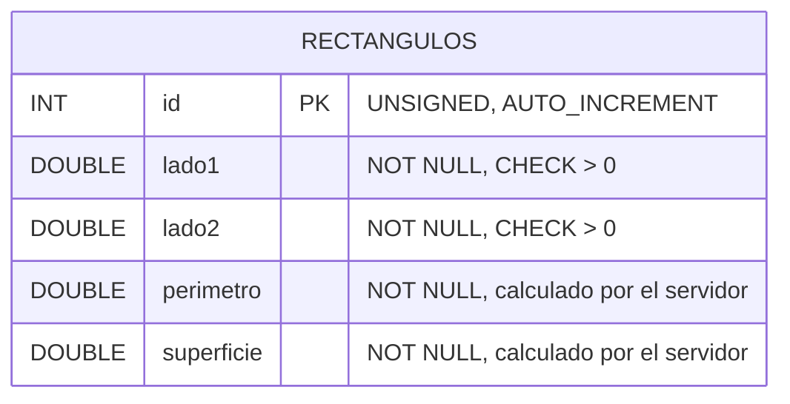

# Ejercicio 1: API de rectángulos

API desarrollada con ExpressJS y MySQL para administrar rectángulos.

## Cómo ejecutar

1. Ejecutar `rectangulos.sql` en MySQL para crear la base y la tabla.
2. Crear un archivo `.env` con:
```
   DB_HOST=localhost
   DB_USER=root
   DB_PASS=tu_contraseña
   DB_DATABASE=tp2_rectangulos
```
3. `npm install`
4. `npm run dev`
5. Probar con `rectangulos.http` (extensión REST Client).

## Diagrama entidad-relación



## Endpoints

| Método | Ruta | Descripción | Respuestas |
|---|---|---|---|
| GET | `/rectangulos` | Lista los rectángulos. Filtros opcionales: `superficieMin`, `superficieMax` | 200, 400 |
| GET | `/rectangulos/:id` | Devuelve un rectángulo | 200, 400, 404 |
| POST | `/rectangulos` | Crea un rectángulo. Body: `{ lado1, lado2 }` | 201, 400 |
| PUT | `/rectangulos/:id` | Modifica un rectángulo. Body: `{ lado1, lado2 }` | 200, 400, 404 |
| DELETE | `/rectangulos/:id` | Elimina un rectángulo | 204, 400, 404 |

## Fundamentación

### Modelo de datos

- **Una sola tabla**: el problema tiene una única entidad (rectángulo), sin relaciones con otras.
- **`DOUBLE` para los lados**: el enunciado pide valores numéricos mayores que cero, sin exigir enteros, por lo que se admiten decimales (por ejemplo, 2.5).
- **Se guardan perímetro y superficie**: lo exige el enunciado. Como solo el servidor los calcula a partir de los lados, siempre son consistentes con ellos.
- **`CHECK (lado > 0)`**: es una segunda barrera en la base de datos. Aunque se inserten datos sin pasar por la API, MySQL rechaza lados inválidos.
- **`id` autoincremental `UNSIGNED`**: identificador generado por la base, nunca negativo.

### API

- **Recurso `/rectangulos`** en plural, con los métodos HTTP estándar: GET para consultar, POST para crear, PUT para modificar y DELETE para eliminar.
- **PUT en lugar de PATCH**: al modificar se reciben los dos lados, porque ambos son necesarios para recalcular el perímetro y la superficie.
- **Cálculo en el servidor**: la función `calcular()` obtiene el perímetro, `2 * (lado1 + lado2)`, y la superficie, `lado1 * lado2`, antes de guardar. Se usa tanto al crear como al modificar.
- **Se rechazan `perimetro` y `superficie` si el cliente los envía**: en lugar de ignorarlos en silencio, la API responde 400, así el cliente sabe que esos valores no le corresponden.
- **Validaciones con express-validator**:
  - `param("id")`: entero mayor a 0.
  - `body("lado1")` y `body("lado2")`: obligatorios y numéricos mayores a 0.
  - `query("superficieMin")` y `query("superficieMax")`: opcionales, pero si vienen deben ser números mayores a 0.
- **Códigos de respuesta**:
  - 201 al crear.
  - 204 al eliminar, porque no hay contenido que devolver.
  - 400 ante datos inválidos.
  - 404 si el rectángulo no existe, lo que se detecta con `affectedRows === 0` en PUT y DELETE.
- **Consultas parametrizadas (`?`)**: evitan la inyección SQL.