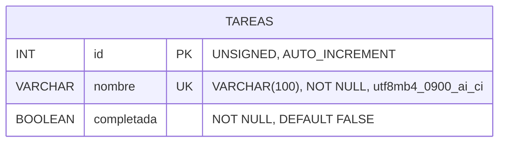

# Ejercicio 2: API de lista de tareas

API desarrollada con ExpressJS y MySQL para administrar una lista de tareas.

## Cómo ejecutar

1. Ejecutar `tareas.sql` en MySQL para crear la base y la tabla.
2. Crear un archivo `.env` con:
```
   DB_HOST=localhost
   DB_USER=root
   DB_PASS=tu_contraseña
   DB_DATABASE=tp2_tareas
```
3. `npm install`
4. `npm run dev`
5. Probar con `tareas.http` (extensión REST Client), ejecutando las peticiones en orden.

## Diagrama entidad-relación



## Endpoints

| Método | Ruta | Descripción | Respuestas |
|---|---|---|---|
| GET | `/tareas` | Lista las tareas. Filtro opcional: `estado=completadas` o `estado=pendientes` | 200, 400 |
| GET | `/tareas/:id` | Devuelve una tarea | 200, 400, 404 |
| POST | `/tareas` | Crea una tarea. Body: `{ nombre, completada? }` | 201, 400, 409 |
| PUT | `/tareas/:id` | Modifica una tarea. Body: `{ nombre, completada }` | 200, 400, 404, 409 |
| DELETE | `/tareas/:id` | Elimina una tarea | 204, 400, 404 |

## Criterio de comparación de nombres

Dos nombres se consideran **iguales** si coinciden después de aplicar estas reglas:

| Regla | Dónde se aplica | Ejemplo de nombres iguales |
|---|---|---|
| Se ignoran espacios al inicio y al final | Servidor (`trim`) | `"Comprar pan"` = `"  Comprar pan  "` |
| Varios espacios seguidos equivalen a uno | Servidor (`customSanitizer`) | `"Comprar pan"` = `"Comprar    pan"` |
| No se distinguen mayúsculas y minúsculas | MySQL (collation `_ci`) | `"Comprar pan"` = `"COMPRAR PAN"` |
| No se distinguen tildes | MySQL (collation `_ai`) | `"Comprar pan"` = `"Comprár pan"` |

El nombre se guarda ya "limpio" (sin espacios sobrantes), conservando las mayúsculas y tildes que escribió el usuario.

## Fundamentación

### Modelo de datos

- **Una sola tabla**: el problema tiene una única entidad (tarea).
- **`nombre VARCHAR(100)`**: es un límite razonable para el título de una tarea, y la API lo valida.
- **Collation `utf8mb4_0900_ai_ci`**: hace que MySQL compare los nombres sin distinguir mayúsculas ni tildes. Así, el mismo criterio se aplica tanto al buscar duplicados como en el índice único.
- **Restricción `UNIQUE (nombre)`**: es una segunda barrera en la base. Aunque se inserten datos sin pasar por la API, no puede haber dos nombres iguales según el criterio.
- **`completada BOOLEAN DEFAULT FALSE`**: una tarea nueva arranca pendiente. MySQL la guarda como 0/1, y la API la convierte a `true`/`false` al responder.

### API

- **Recurso `/tareas`** con los métodos HTTP estándar: GET para consultar, POST para crear, PUT para modificar y DELETE para eliminar.
- **Consulta por estado con query string** (`GET /tareas?estado=completadas`): es un filtro sobre la misma colección, no un recurso distinto. Solo se admiten los valores `completadas` y `pendientes`.
- **`completada` opcional al crear**: lo habitual es crear tareas pendientes. En PUT es obligatorio, porque PUT reemplaza todos los datos de la tarea.
- **Estado como booleano estricto**: solo se acepta `true` o `false` (tipo booleano de JSON). Se rechazan `"true"`, `1`, `"si"`, etc.
- **Validaciones con express-validator**:
  - `param("id")`: entero mayor a 0.
  - `body("nombre")`: obligatorio, texto, no vacío después de limpiar los espacios, hasta 100 caracteres, y único. Para la unicidad se consulta la base con una validación personalizada (`custom`), que al modificar excluye a la propia tarea.
  - `body("completada")`: booleano.
  - `query("estado")`: `completadas` o `pendientes`.
- **Códigos de respuesta**:
  - 201 al crear.
  - 204 al eliminar.
  - 400 ante datos inválidos, incluido un nombre repetido detectado por la validación.
  - 404 si la tarea no existe.
  - 409 si, a pesar de la validación, la base rechaza un duplicado (por ejemplo, dos pedidos simultáneos con el mismo nombre).
- **Consultas parametrizadas (`?`)**: evitan la inyección SQL.