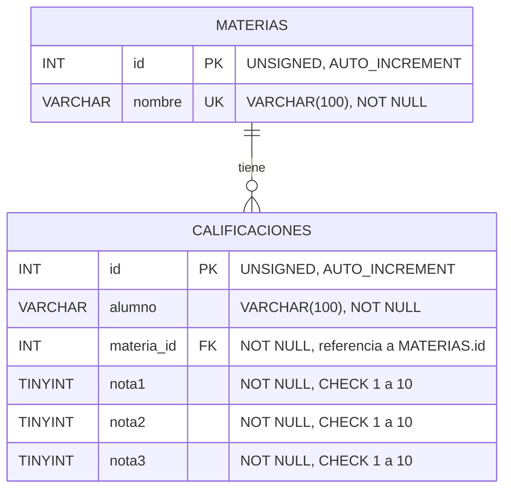

# Ejercicio 3: API de calificaciones de alumnos

API desarrollada con ExpressJS y MySQL para gestionar las calificaciones de alumnos en las materias de una carrera.

## Cómo ejecutar

1. Ejecutar `calificaciones.sql` en MySQL. Crea la base, las tablas y 4 materias de ejemplo.
2. Crear un archivo `.env` con:
```
   DB_HOST=localhost
   DB_USER=root
   DB_PASS=tu_contraseña
   DB_DATABASE=tp2_calificaciones
```
3. `npm install`
4. `npm run dev`
5. Probar con `calificaciones.http` (extensión REST Client), ejecutando las peticiones en orden.

## Diagrama entidad-relación



Relación **uno a muchos**: una materia puede tener muchas calificaciones, y cada calificación pertenece a una sola materia. Además, la combinación `(alumno, materia_id)` es única.

## Escala de notas

Las notas son **números enteros del 1 al 10**, la escala habitual en la universidad. Se rechazan decimales, valores fuera de rango y textos.

## Endpoints

### Materias

| Método | Ruta | Descripción | Respuestas |
|---|---|---|---|
| GET | `/materias` | Lista las materias | 200 |
| GET | `/materias/:id` | Devuelve una materia | 200, 400, 404 |
| GET | `/materias/:id/calificaciones` | Devuelve las calificaciones de una materia | 200, 400, 404 |
| POST | `/materias` | Crea una materia. Body: `{ nombre }` | 201, 400, 409 |
| PUT | `/materias/:id` | Modifica una materia. Body: `{ nombre }` | 200, 400, 404, 409 |
| DELETE | `/materias/:id` | Elimina una materia (solo si no tiene calificaciones) | 204, 400, 404, 409 |

### Calificaciones

| Método | Ruta | Descripción | Respuestas |
|---|---|---|---|
| GET | `/calificaciones` | Lista las calificaciones. Filtros opcionales: `alumno` (búsqueda parcial) y `materiaId` | 200, 400 |
| GET | `/calificaciones/:id` | Devuelve una calificación | 200, 400, 404 |
| POST | `/calificaciones` | Crea un registro. Body: `{ alumno, materiaId, notas: [n1, n2, n3] }` | 201, 400, 409 |
| PUT | `/calificaciones/:id` | Modifica un registro. Body: igual que en POST | 200, 400, 404, 409 |
| DELETE | `/calificaciones/:id` | Elimina un registro | 204, 400, 404 |

### Alumnos

| Método | Ruta | Descripción | Respuestas |
|---|---|---|---|
| GET | `/alumnos` | Lista los alumnos con todas sus calificaciones agrupadas. Filtro opcional: `nombre` (búsqueda parcial) | 200, 400 |

## Fundamentación

### Modelo de datos

- **Dos tablas relacionadas**: `materias` y `calificaciones`, unidas por la clave foránea `materia_id`, como pide el enunciado. Así el nombre de cada materia se guarda una sola vez, sin repetirse en cada registro.
- **El alumno como texto dentro de `calificaciones`**: el enunciado pide guardar en cada registro el nombre del alumno, y no exige gestionar alumnos como entidad aparte.
- **Tres columnas de notas (`nota1`, `nota2`, `nota3`)**: la cantidad de notas es fija (exactamente tres), así que no hace falta una tabla de notas aparte. Esto además permite un `CHECK` por columna.
- **`TINYINT UNSIGNED` con `CHECK BETWEEN 1 AND 10`**: un entero chico alcanza para la escala, y la base rechaza valores fuera de rango aunque no pasen por la API.
- **`UNIQUE (alumno, materia_id)`**: es la regla de unicidad a nivel base de datos. Un alumno puede estar en varias materias, pero tiene un solo registro por materia.
- **Collation `utf8mb4_0900_ai_ci`**: compara textos sin distinguir mayúsculas ni tildes. Junto con la limpieza de espacios que hace el servidor, "Juan Pérez" y "  juan   PEREZ " se consideran el mismo alumno. El mismo criterio se aplica a los nombres de las materias.
- **Clave foránea sin borrado en cascada**: no se puede eliminar una materia que tiene calificaciones, para no perder notas por accidente. La API responde 409 en ese caso.

### API

- **Tres recursos: `/materias`, `/calificaciones` y `/alumnos`**, con los métodos HTTP estándar. Además está `/materias/:id/calificaciones`, para consultar las notas de una materia.
- **Recurso `/alumnos` de solo lectura**: como el enunciado pide guardar el nombre del alumno en cada registro (sin una tabla propia), los alumnos se crean y modifican a través de `/calificaciones`. `/alumnos` permite consultarlos agrupando sus calificaciones. Para agrupar se usa el mismo criterio de comparación que en la regla de unicidad (sin distinguir mayúsculas, tildes ni espacios sobrantes).
- **Notas como arreglo en el body** (`"notas": [7, 8, 9]`): hace explícito que son exactamente tres, y se valida con `isArray({ min: 3, max: 3 })`. La respuesta usa el mismo formato.
- **La materia en la respuesta como objeto** `{ id, nombre }`, obtenido con un `JOIN`, así el cliente no necesita otra consulta para saber el nombre.
- **Validaciones con express-validator**:
  - `param("id")`: entero mayor a 0.
  - `body("alumno")`: obligatorio, texto, entre 2 y 100 caracteres, solo letras (incluidas tildes y ñ), espacios y apóstrofos. Antes de validar, se limpian los espacios sobrantes.
  - `body("materiaId")`: entero mayor a 0 y existente en la tabla `materias`, verificado con una consulta (`custom`).
  - `body("notas")`: arreglo de exactamente 3 elementos.
  - `body("notas.*")`: cada nota debe ser de tipo número y entera entre 1 y 10.
  - **Unicidad**: una validación `custom` consulta si ya existe la combinación alumno + materia. Al modificar, excluye el propio registro.
  - `query("alumno")`, `query("materiaId")` y `query("nombre")`: filtros opcionales validados.
- **Códigos de respuesta**:
  - 201 al crear.
  - 204 al eliminar.
  - 400 ante datos inválidos, incluidos los duplicados detectados por la validación.
  - 404 si el recurso no existe.
  - 409 cuando la base rechaza la operación por integridad: un duplicado simultáneo, o borrar una materia con calificaciones.
- **Consultas parametrizadas (`?`)**: evitan la inyección SQL.